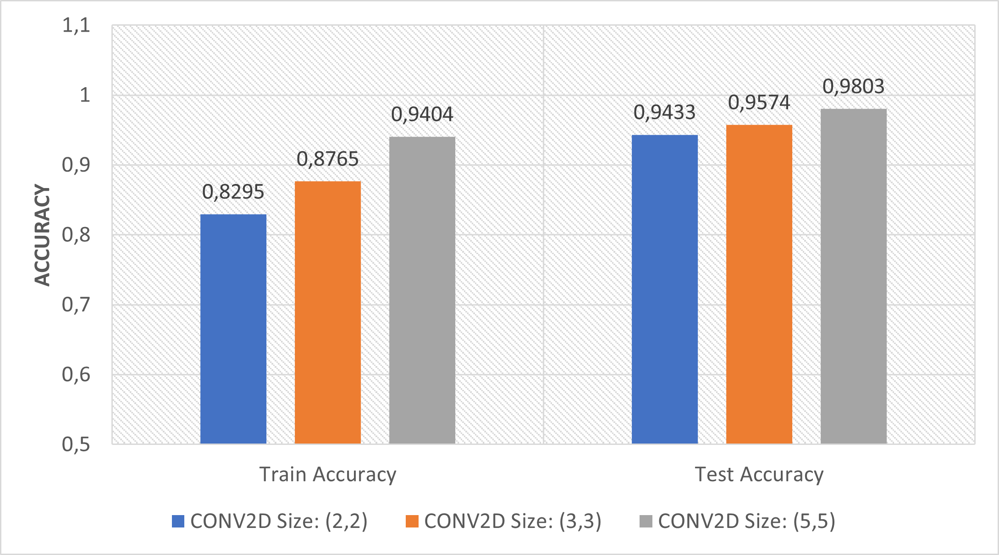
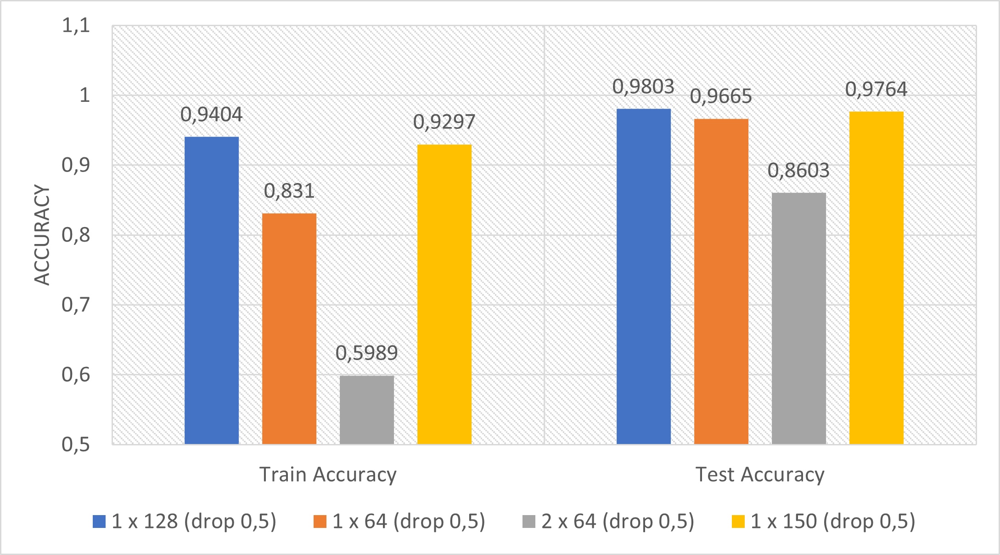
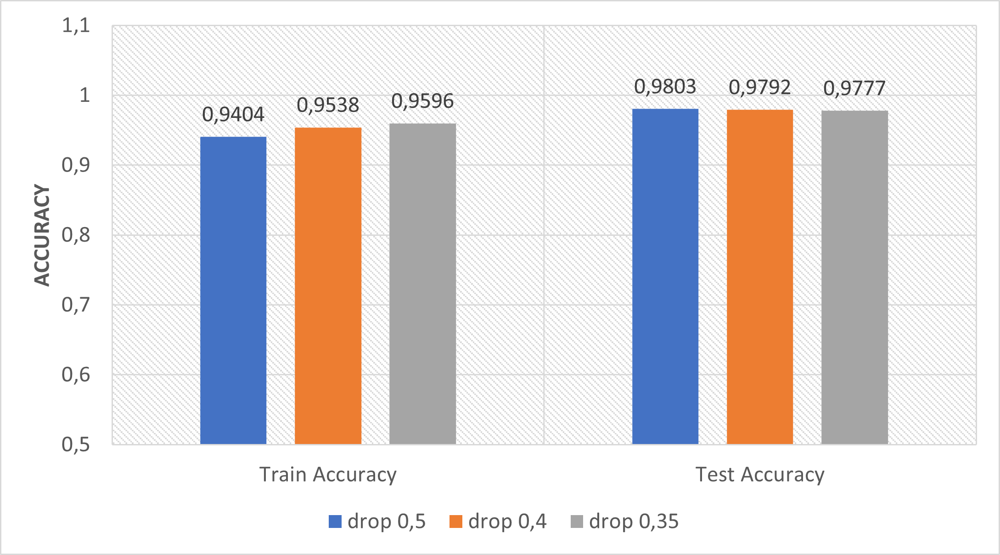

# Traffic Sign Identification Using Deep Learning

This is an implementation of a [Convolutional Neural Network](https://en.wikipedia.org/wiki/Convolutional_neural_network) trained to identify between 43 different traffic signs. The database could be found [here](https://cdn.cs50.net/ai/2020/x/projects/5/gtsrb.zip). It was implemented using keras-Tensorflow and OpenCV-Python. 


It was made as an activity for the Harvard's Course [CS50’s Introduction to Artificial Intelligence with python](https://cs50.harvard.edu/ai/2020/). 

## Network Structure

The network has different layers:

* Convolutional layer : 30 filters-kernels of 5px by 5px 

* Pooling layer: 3 px by 3px maxpooling

* Dense layer: 150 neurons with 0.35 of dropping

* Output layer

## Defining hyperparameters

Several test were done to define some hyperparameters with the objective of increasing accuracy in both training and test set.

First, the size of the CONV2D layer was tested: between 2x2, 3x3 and 5x5 pixels. The last option had the greatest accuracy(0.940 and 0.980)

 
_Figure 01: accuracy vs kernel size in CONV2D layer (without vary any other parameter)_

Then, several hidden layer were tested. Starting with one layer of 128 neurons, then testing  with two layers (it showed very poor accuracy, maybe due to the relatively small size of the dataset). Finally, one layer of 150 neurons was chosen.

 
_Figure 02: accuracy vs hidden layer(s) (without vary any other parameter)_

After that, the percentage of dropout was decreased from 0.5 to 0.35, because the network showed better accuracy and didn’t show over-fitting. 

 
_Figure 03: accuracy vs dropout (without vary any other parameter)_

## How to use it

Look in my [repo](https://github.com/Marouxet/cs50/tree/05-traffic), to download the files and run the network. You can train your own model using "traffic.py" and also can test my model (model.h5) with a new image of a traffic sign using "test.py". 

Yo need to have in the same folder:

* The image
* The file test.py
* The model model.h5
* The .txt file "keys.txt"

Then, run:


```
$  python test.py [imagen] model.h5
```

Here there is a video with the network's training and testing:

[](https://www.youtube.com/watch?v=tZhdILlUHRY&t=14s "Neural Network - Mariano Arouxet")

It works!

[back](./)
