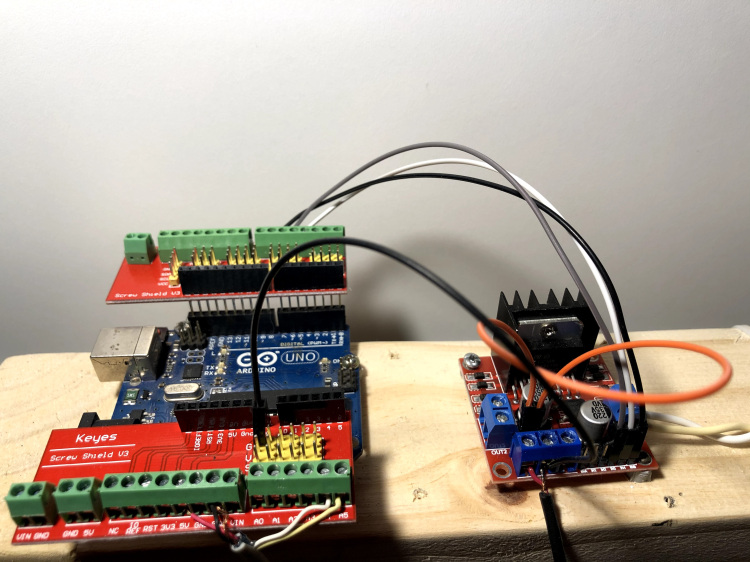
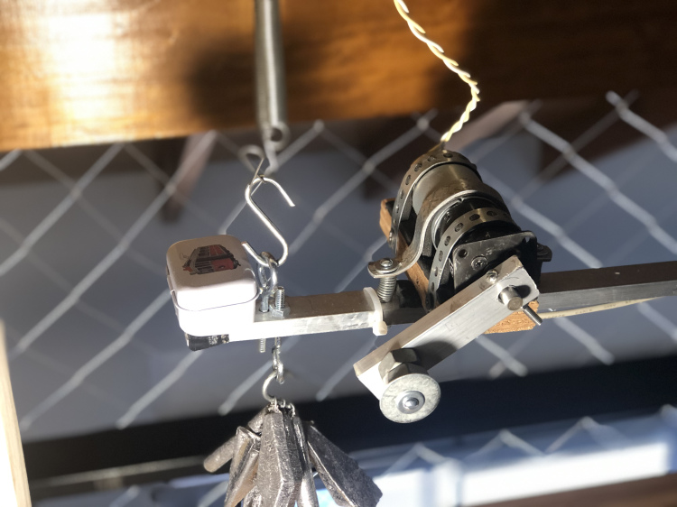
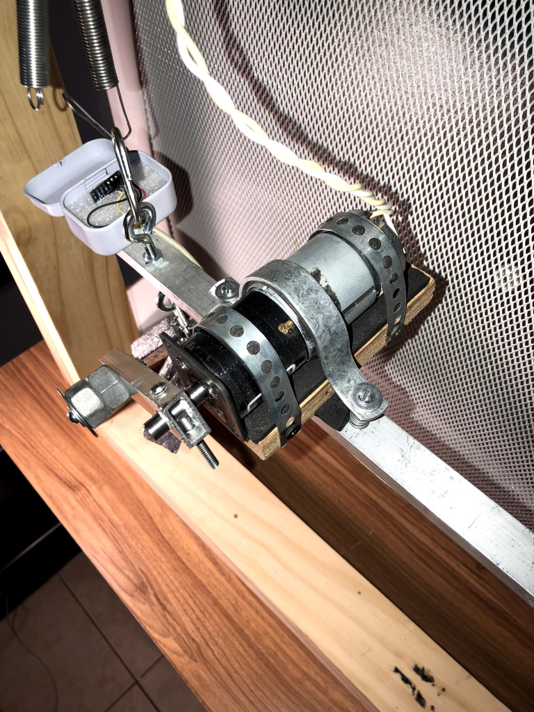

# Medición de vibraciones usando Python, Arduino y el MEMS MPU6050 |_Measuring vibration with Python, Arduino and MPU6050 chip_


En este post describiré un proyecto que realicé durante la cuarentena por la pandemia de COVID-19. Se trata de un dispositivo low-cost que nos ayuda a estudiar sistemas vibratorios de un grado de libertad, fenómenos como resonancia, armotiguación, rigidez de resortes, transmisibilidad.

El proyecto consiste en un sistema masa-resorte al que se puede estudiar de manera libre o de manera forzada. El dispositivo fue pensado para poder dar clases de Acústica, y estudiar sistemas masa-resortes con un objeto real. Tiene dos objetivos principales:

* Poder medir aceleraciones utilizando el chip MPU-6050 comandado por un Arduino UNO mediante una interface gráfica hecha en Python, usando el framework Kivy.
* Excitar el dispositivo a diferentes frecuenccias mediante un motor DC, cuya velocidad se puede variar desde la misma interface gráfica.


Animación del funcionamiento libre


El arduino, el mems y el proyecto original fueron ~~prestadps~~ regalados por [Facundo Ramón](https://www.linkedin.com/in/facundo-ramon/), que utilizó el dispostivo para su tesis de grado. Originalmente él hizo una interface en Processing, que no terminé usando, y un sistema de comunicación serial con Arduino que me sirvió de base para este proyecto. Gracias Facu!

Algunas fotos del sistema





## El código en Arduino

Mediante arduino leemos la información que genera el MPU6050 y la enviamos por el puerto USB hacia la PC. Además, tomamos de la PC comandos serie para iniciar la captura de datos, detenerla y cambiar la velocidad de rotación del motor. Para esto utilizamos las librerías I2Cdev.h y MPU6050.h, que me simplificaron muchísimo el trabajo.

Para comenzar desde cero con el manejor del chicp MPU6050 con arduino, recomiendo fuértemente los posteos de luisllamas. Estos son particularmente de ayuda:

https://www.luisllamas.es/arduino-orientacion-imu-mpu-6050/
https://www.luisllamas.es/medir-la-inclinacion-imu-arduino-filtro-complementario/

Por otro lado, para manejar la velocidad del motor DC por PWM utilizé el driver L298N. Pueden encontrar información sobre esto, por ejemplo, acá:

https://howtomechatronics.com/tutorials/arduino/arduino-dc-motor-control-tutorial-l298n-pwm-h-bridge/

## ¿En qué consiste el código?

* en Setup configuramos las entradas y salidas de arduino (tanto para el MPU6050 como para el L298N), la comunicación i2c con el MPU6050, la comunicación serie con Python.

* en Loop simplemente tomamos información por i2c desde el MPU6050 y la enviamos por el puerto serie en crudo (es decir en forma de bytes). Esto lo decidí para realizar todo el procesamiento directamente en python.

* Mediante el SerialEvent se realiza toda la comunicación con la pc. Recibimos 3 posibles caracteres por el puerto serie: ‘r’ indica read, ‘s’ indica stop y ‘v’ indica cambio de velocidad mediante unas variables logicas direcciona el flujo del programa dentro de loop.
El control de velocidad con PWM lo hacemos recibiendo un número entre 0 y 255 desde python (en realidad luego acoté el rango de 80 a 120 por el funcionamiento específico de mi motor) y escribiéndolo directamente en la salida digital que va conectada al driver.

```c++

#include "I2Cdev.h"
#include "MPU6050.h"
 
// Arduino Wire library is required if I2Cdev I2CDEV_ARDUINO_WIRE implementation
// is used in I2Cdev.h
#if I2CDEV_IMPLEMENTATION == I2CDEV_ARDUINO_WIRE
    #include "Wire.h"
#endif
 
MPU6050 accelgyro;
 
int16_t ax, ay, az;
int16_t gx, gy, gz;
 
bool measure = false;
bool changeVel = false;
 
 
// Salidas para PWM para el L298N
int IN3 = 5;    // Input3 conectada al pin 5
int IN4 = 4;    // Input4 conectada al pin 4 
int ENB = 6;    // ENB conectada al pin 3 de Arduino
 
int velocidad = 0;
 
#define OUTPUT_BINARY_ACCELGYRO
#define LED_PIN 13
bool blinkState = false;
 
void setup() {
 
 
 
    // join I2C bus (I2Cdev library doesn't do this automatically)
    #if I2CDEV_IMPLEMENTATION == I2CDEV_ARDUINO_WIRE
        Wire.begin();
    #elif I2CDEV_IMPLEMENTATION == I2CDEV_BUILTIN_FASTWIRE
        Fastwire::setup(400, true);
    #endif
 
    // initialize serial communication
    Serial.begin(115200);
 
    // initialize device
    // Serial.println("Initializing I2C devices...");
    accelgyro.initialize();
 
    // verify connection
    Serial.println(accelgyro.testConnection() ? "_OK_" : "MPU6050 UNTREF failed");
    accelgyro.setXAccelOffset(1596);

 
   // configure Arduino LED pin for output
   pinMode (ENB, OUTPUT); 
   pinMode (IN3, OUTPUT);
   pinMode (IN4, OUTPUT);
  
  digitalWrite (IN3, HIGH);
  digitalWrite (IN4, LOW);
}
 
void loop() {
   
   
if(measure){

    accelgyro.getMotion6(&ax, &ay, &az, &gx, &gy, &gz);

    #ifdef OUTPUT_BINARY_ACCELGYRO
      Serial.write((uint8_t)(ax >> 8)); Serial.write((uint8_t)(ax & 0xFF));
      Serial.write((uint8_t)(az >> 8)); Serial.write((uint8_t)(az & 0xFF));
      Serial.write((uint8_t)(gy >> 8)); Serial.write((uint8_t)(gy & 0xFF));
    #endif
 
 
}
 
else{
   
  measure = true;
  }
 
 
}
 
void serialEvent() {
 
  char inChar = (char)Serial.read();
   
  switch (inChar) {
    case 'r': //run
     
      measure = true;
      digitalWrite (IN3, HIGH);
      digitalWrite (IN4, LOW);
      break;
      
    case 's': //stop
     
      measure = false;
      digitalWrite (IN3, LOW);
      digitalWrite (IN4, LOW);
      break;
 
     case 'v':
      
       int velocidad= Serial.parseInt();
       analogWrite(ENB,velocidad);
       measure = false;
       break; 
  }
   
}

```

## Lectura de datos series desde Python

Luego de varias pruebas, decidí utilizar un thread independiente para la lectura de datos serie. La idea de este proceso es que la lectura de datos funcione en paralelo con la interface gráfica para evitar la pérdida de datos o problemas de sincronización. En realidad las actividades no van en paralelo sino son seriales, pero eso lo administra python y para nosotros van a la vez. Usé como base un posteo de [The Poor Engineer](https://thepoorengineer.com/en/arduino-python-plot/#python) para graficar lecturas seriales en Python usando Matplotlib. En mi caso utilizo Kivy como framework para la interface gráfica, por lo que adapté el código para eso.

El script serialMPU.py se encarga de la comunicación. La clase SerialPlot genera la comunicación (indicamos Baudrate, formato de la información, puerto, etc.) y con el método readSerialStart iniciamos el Thread en paralelo. Lo que se ejecuta en paralelo es el método backgroundThread, mediante el cual se leen constantemente datos serie y se los guarda en una variable.

```python
from threading import Thread
import serial
import time
import collections
import struct
import copy
import os
import numpy as np
   
class serialPlot:
    def __init__(self, serialPort='/dev/ttyACM0', serialBaud=38400, dataNumBytes=2, numPlots=1, rango=2, sensibilidad = 2**16):
        # Filtado exponencial
        self.EMA_LP = 0 # Valor inicial del filtrado
        self.EMA_LP2 = 0 # Valor inicial del filtrado
        self.EMA_LP3 = 0 # Valor inicial del filtrado
        self.EMA_ALPHA = 0.9 # Coeficiente para el filtro 
         
        self.corregir = 0
        self.port = serialPort
        self.baud = serialBaud
        self.dataNumBytes = dataNumBytes
        self.numPlots = numPlots
        self.rango = rango
        self.sensibilidad = sensibilidad
        self.rawData = bytearray(dataNumBytes)
        self.rawData2 = bytearray(dataNumBytes)
        self.rawData3 = bytearray(dataNumBytes)
        self.dataType = None
        if dataNumBytes == 2:
            self.dataType = 'h'     # 2 byte integer
        elif dataNumBytes == 4:
            self.dataType = 'f'     # 4 byte float
        self.data = []
        
        self.isRun = True
        self.isReceiving = False
        self.thread = None
        self.plotTimer = 0
        self.previousTimer = 0
       
        print('Trying to connect to: ' + str(serialPort) + ' at ' + str(serialBaud) + ' BAUD.')
        try:
            
            self.serialConnection = serial.Serial(serialPort, serialBaud, timeout=4)
            print('Connected to ' + str(serialPort) + ' at ' + str(serialBaud) + ' BAUD.')
        except:
            print("Failed to connect with " + str(serialPort) + ' at ' + str(serialBaud) + ' BAUD.')
  
    def readSerialStart(self):
         
        if self.thread == None:
            self.valores=[]
            self.valores2=[]
            self.thread = Thread(target=self.backgroundThread)
            self.thread.start()
            # Block till we start receiving values
            while self.isReceiving != True:
                time.sleep(0.1)
        else:
            a = 1
  
 
    def backgroundThread(self):    # retrieve data
        time.sleep(1.0)  # give some buffer time for retrieving data
        self.serialConnection.reset_input_buffer()
         
        angYgir_prev = 0
        while (self.isRun):
            self.serialConnection.readinto(self.rawData)
            self.serialConnection.readinto(self.rawData2)
            self.serialConnection.readinto(self.rawData3)
            if self.corregir == 1:
                self.serialConnection.read(1)
                print("Corrigiendo Sincronización")
                self.corregir = 0
            else:
                # Convertir a float desde bytes
                dataFloat = float(struct.unpack('h', self.rawData)[0]*self.rango/self.sensibilidad) # Aceleración en X
                dataFloat2 = float(struct.unpack('h', self.rawData2)[0]*self.rango/self.sensibilidad) # Aceleración en Z
                dataFloat3 = float(struct.unpack('h', self.rawData3)[0]/131) # Velocidad Angular en Y
                # Filtrado Exponencial
                self.dataFiltada = self.EMA_ALPHA * dataFloat + (1 - self.EMA_ALPHA) * self.EMA_LP
                self.dataFiltada2 = self.EMA_ALPHA * dataFloat2 + (1 - self.EMA_ALPHA) * self.EMA_LP2
                self.dataFiltada3 = self.EMA_ALPHA * dataFloat3 + (1 - self.EMA_ALPHA) * self.EMA_LP3
                self.EMA_LP = self.dataFiltada 
                self.EMA_LP2 = self.dataFiltada3 
                self.EMA_LP3 = self.dataFiltada2 
                # Agregar valores de aceleración en x al vector general
                self.valores.append(self.dataFiltada)
                 
                if dataFloat == 0:
                    dataFloat = 0.000001
                if dataFloat2 == 0:
                    dataFloat2 = 0.000001
                if dataFloat3 == 0:
                    dataFloat3 = 0.000001       
                # Cálculo del ángulo de inclinación por medio de filtro complementario
                
                angYacc = np.arctan(dataFloat2/dataFloat) * (180 / np.pi)
                #self.valores.append(angYacc)
                 
                 
                t0 = time.time()
                dt = time.time() - t0
                angYgir = self.dataFiltada3 * dt + angYgir_prev
                angYgir_prev = angYgir
                t0 = dt
 
                # Filtro Complementario
                angYtotal = 0.98 * angYgir + 0.02 * angYacc
                x = np.tan(angYtotal) * 0.8
                #print(angYtotal)
                self.valores2.append(self.dataFiltada3)
                self.isReceiving = True   
 
  
    def close(self):
        self.isRun = False
        self.thread.join()
        self.serialConnection.close()
        print('Disconnected...')

```
## GUI : Kivy Garden

Para la interface gráfica utilicé el framework Kivy, que ya venía usando para otros proyectos. Tiene una serie de desarrollos muy interesantes para hacer aplicaciones que son multiplataforma (Windows, Linux, macOS, Android, iOS). Básicamente se trata de un conjunto de Widgets con determinadas funciones.

Interfaz Gráfica


La página oficial del proyecto Kivy es esta : https://kivy.org
El repo en Github: https://github.com/kivy/kivy
También utilicé Kivy Garden, un proyecto no oficial complementario a Kivy con varias “Flowers” (Widgets) interesantes: https://kivy-garden.github.io/

A su vez, recomiendo el Canal de Youtube de Erik Sandberg, que fue lo que utilicé yo para comenzar con Kivy.

La aplicación está basada en un Widget de Garden llamado Graph y en un timer llamado Kivy-Clock. En el thread principal voy actualizando los diferentes gráficos con los datos que almaceno en una variable desde el thread de serialización.

El código de la interface gráfica está hecho en un formato llamado Lenguage Kv, que podemos considerar una especie de CSS para nuestro PHP que sería Python. Con el lenguaje Kv podemos separar la lógica del diseño, lo cual me parece conveniente.


[back](./)
